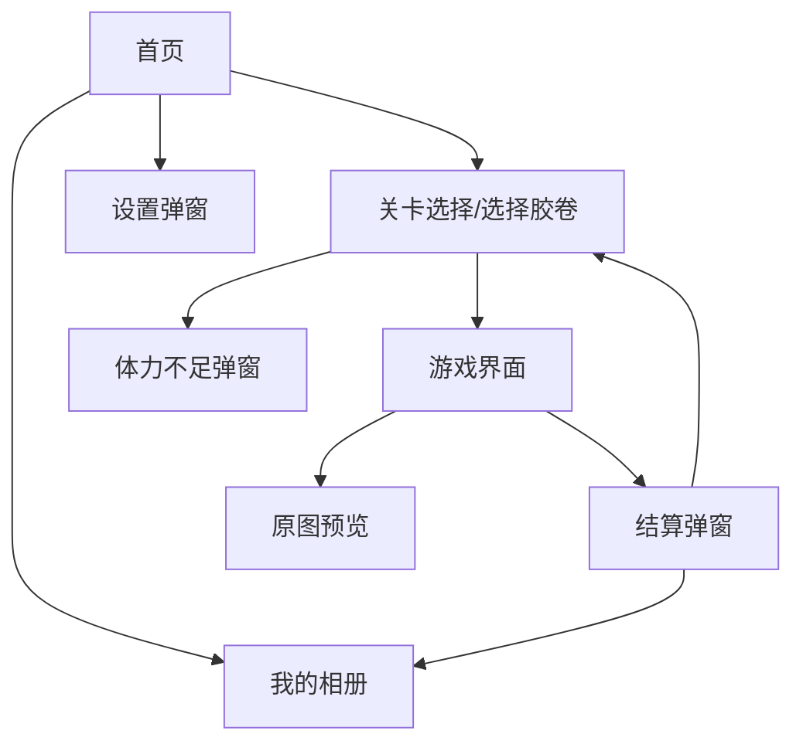

# 产品需求文档 (PRD) - 旧时光照相馆

## 1. 文档信息
| 项目名称 | 旧时光照相馆 (OldTimeStudio) |
| :--- | :--- |
| 文档版本 | V1.0 |
| 文档状态 | 正式稿 |
| 撰写日期 | 2026-03-09 |
| 目标平台 | 抖音小游戏 |

## 2. 项目背景与目标
### 2.1 产品定位
一款主打怀旧风格的拼图闯关小游戏。玩家扮演一家老照相馆的经营者，通过完成拼图（修复老照片）来收集充满时代回忆的物品（如童年玩具、老式物件等），并将其收藏在相册中。

### 2.2 核心体验
- **视觉风格**：80-90年代复古风，泛黄纸张、墨水色调、衬线字体。
- **核心玩法**：经典的滑动拼图（华容道玩法），难度循序渐进（3x3 -> 4x4 -> 5x5）。
- **情感体验**：通过“修复照片”的概念，唤起玩家的怀旧情感。

## 3. 功能架构图

## 4. 详细功能需求

### 4.1 首页 (Main Menu)
**页面描述**：游戏的启动页，营造复古氛围。
- **UI元素**：
  - **左上角**：体力/胶卷显示组件（图标+文字 `📷 剩余: 5/5`）。
  - **次数下方**：设置按钮（`⚙️`图标），位于体力/次数组件正下方，点击弹出设置弹窗。
  - **中央**：游戏标题“旧时光照相馆”、副标题“Old Time Studio”、装饰性老相机图标。
  - **底部**：操作按钮区。
    - 主按钮：“开始游戏”（直接进入游戏页面）。
    - 副按钮：“我的相册”（进入相册页面）。
  - **页脚**：版权信息 `(C) 1980s Memory Co.`。
- **交互逻辑**：
  - 点击“开始游戏”：
    - 检查体力是否 > 0。
    - 若体力充足，扣除 1 次并直接进入 [4.3 游戏界面]（默认加载第 1 关）。
    - 若体力不足，弹出 [4.7 体力不足弹窗]。
  - 点击“我的相册”：跳转至 [4.5 我的相册]。
  - 点击“设置”：弹出 [4.6 设置弹窗]。
 - **次数与扣减规则**：
   1. 每日初始次数为 5（显示为“📷 剩余: 5/5”），每日自动重置。
  2. 在首页点击“开始游戏”时进行扣减：次数 > 0 则扣 1 并直接进入第 1 关；次数 = 0 则弹出体力不足弹窗。
   3. 若本次拼图成功，可在结算后直接进入下一张拼图，期间不再额外扣除次数（属同一“营业链路”）。
   4. 若中途放弃或失败回到首页，重新点击“开始营业”将再次扣除 1 次。
   5. 点击次数组件上的“＋”也会唤起体力不足弹窗（可通过激励广告恢复 1 次）。
  6. “＋”按钮显示规则：当剩余次数 < 5 时在首页与游戏页面显示“＋”；点击弹出体力不足弹窗，提示“观看广告(+1⚡)”恢复一次。
 - **验收标准**：
   1. 次数随点击“开始营业”准确减少；成功后续连续挑战不再扣次。
   2. 次数为 0 时，点击“开始营业”或“＋”均弹出体力不足弹窗。
  3. 页面显示的“剩余: X/5”与实际次数状态一致。
  4. 当剩余次数 < 5 时，倒计时按秒递减且在恢复时归零并增加 1 次。

**每日次数充值与跨天策略**
1. 数据存储：全部采用本地存储（包括当前次数、最近恢复时间戳、当天日期）。
2. 每日次数：每日上限 5 次；跨天后直接重置为 5 次。
3. 当日恢复：每消耗 1 次后，开始计时；每 10 分钟自动恢复 1 次，直到恢复到当天上限 5 次为止。
4. 异常与边界：不考虑手动更改系统时间造成的异常。
5. 倒计时显示：当剩余次数 < 5 时，首页次数组件显示下一次恢复倒计时（格式 mm:ss）。
6. 展示样式：倒计时以胶片徽标样式展示；体力不足弹窗同步显示“预计恢复: mm:ss”。
7. “＋”按钮样式：与倒计时一致采用胶片徽标样式，文案为“🎞️ ＋”。

### 4.2 关卡选择（本版本不包含）
本版本不提供关卡选择页面；玩家从首页进入游戏后，默认加载第 1 关，通关后可通过“下一张”顺序挑战第 2 关、 第 3 关……线性推进。

### 4.3 游戏界面 (Gameplay)
**页面描述**：核心拼图玩法页面。
- **UI元素**：
  - **顶部栏**：“放弃”按钮（返回关卡页）、当前关卡名称（如“正在修复: 童年玩具”）、预览按钮（`?`）。
  - **状态栏**：显示当前耗时（TIME）、移动步数（STEP）。
  - **游戏区**：N x N 的网格棋盘，显示切碎的图片块，留有一个空格。
  - **底部操作栏**：
    - “重置”：重新打乱当前拼图。
    - “提示”：弹出 [4.8 原图预览]。
    - “直接胜利”（开发调试用）：直接触发胜利结算。
- **业务规则**：
  - **关卡加载**：默认加载第 1 关；选择“下一张”则顺序进入第 2 关、第 3 关……不区分类型分类。
  - **关卡总数与难度配置**：
    1. 总计 100 关。
    2. 第 1 关为 3x3；第 2 关为 4x4；第 3 关为 5x5；
    3. 自第 4 关起及其后续关卡统一为 6x6。
  - **拼图生成**：将目标图片切割为 N*N 块，去掉最后一块作为空格，随机打乱（需保证有解）。
  - **移动逻辑**：点击空格周围（上下左右）的图片块，将其移动到空格位置。
  - **胜利判定**：所有图片块恢复到正确顺序。
- **交互逻辑**：
  - 胜利后：自动弹出 [4.4 结算弹窗]；若选择“下一张”，在当前营业链路中继续挑战不再扣次，按关卡序号线性推进。
  - 点击“预览”：弹出原图预览层。

### 4.4 结算弹窗 (Result Modal)
**页面描述**：展示关卡挑战结果。
- **UI元素**：
  - 成功印章：“修复成功”。
  - 目标图片：展示完整清晰的大图。
  - 统计数据：耗时、步数。
  - 怀旧文案：随机展示一句怀旧语录（如“那是1984年的夏天...”）。
  - 按钮：“下一张”（返回关卡选择或进入下一关）、“分享”（分享到抖音好友/群）。
- **数据更新**：
  - 将当前关卡ID加入“已收集”列表，并将对应图片保存到相册中。
  - 解锁下一关。

### 4.5 我的相册 (Gallery)
**页面描述**：展示玩家所有已收集（通关）的照片。
- **UI元素**：
  - **顶部栏**：“返回”按钮、标题“我的相册”。
  - **照片墙**：
    - **空状态**：若无收集数据，显示“暂无照片，快去‘开始营业’收集吧！”。
    - **有数据**：展示已通关关卡对应的图片列表（每完成一个关卡即保存一张到相册）。
- **交互逻辑**：
  - 点击照片：查看大图（可缩放查看细节）。
 - **次数显示范围**：相册页面不展示体力/次数，体力与倒计时仅在首页与游戏页面显示。

### 4.6 设置弹窗 (Settings)
**页面描述**：游戏系统设置。
- **UI元素**：
  - **入口位置**：位于首页体力/次数组件正下方的 `⚙️` 按钮。
  - **背景音乐**：开关（默认开）。
  - **音效**：开关（默认开）。
  - **震动**：开关（默认开）。
  - **版本信息**：显示当前版本号。
- **交互逻辑**：
  - 点击开关实时生效并保存状态到本地存储。
  - 关闭弹窗后，设置保持不变并在后续游戏过程中生效。

### 4.7 体力不足弹窗 (Energy Modal)
**页面描述**：当体力为0时触发。
- **UI元素**：
  - 提示文案：“体力不足”。
  - 剩余显示：`⚡ 0/5`。
  - 按钮：“观看广告 (+1⚡)”、“稍后再来”。
- **交互逻辑**：
  - 触发条件：
    1. 首页点击“开始营业”且当前次数为 0/5。
    2. 点击首页次数组件上的“＋”。
  - 点击“观看广告”：调用激励视频，播放完成后恢复 1 次，并更新首页显示。

### 4.8 原图预览 (Preview Modal)
**页面描述**：游戏中查看目标图。
- **UI元素**：
  - 完整的目标图片。
  - 倒计时提示（如“5秒后自动关闭”）。
  - “关闭”按钮。
- **交互逻辑**：
  - 倒计时结束或点击关闭：隐藏弹窗，回到游戏。

## 5. 非功能需求
1.  **性能**：首屏加载速度 < 2秒，操作响应无明显延迟。
2.  **适配**：兼容主流机型（iOS/Android），UI自适应不同屏幕比例（全面屏/刘海屏）。
3.  **数据持久化**：
    - 本地存储玩家的体力、通关记录（已解锁关卡）、收集相册、设置项。
    - 离线状态下也能正常记录进度。
4.  **架构约束**：不接入服务端；所有数据与规则均在本地实现；不支持跨设备同步。
